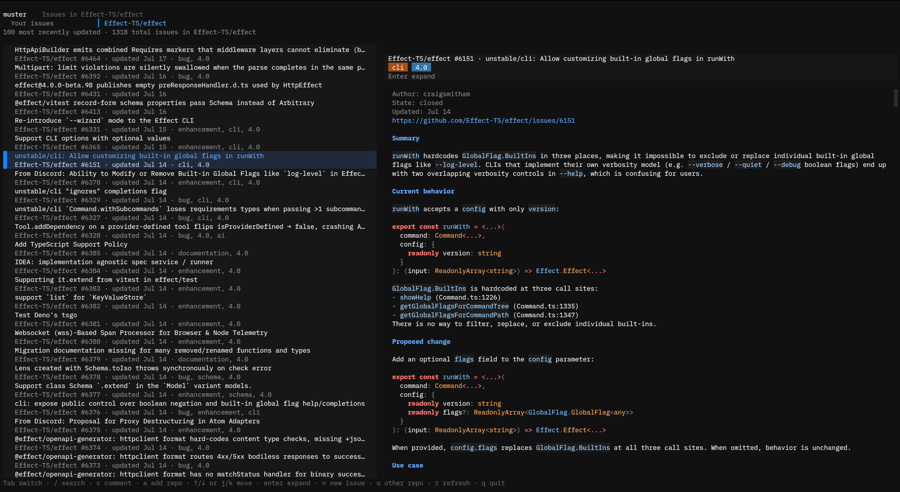
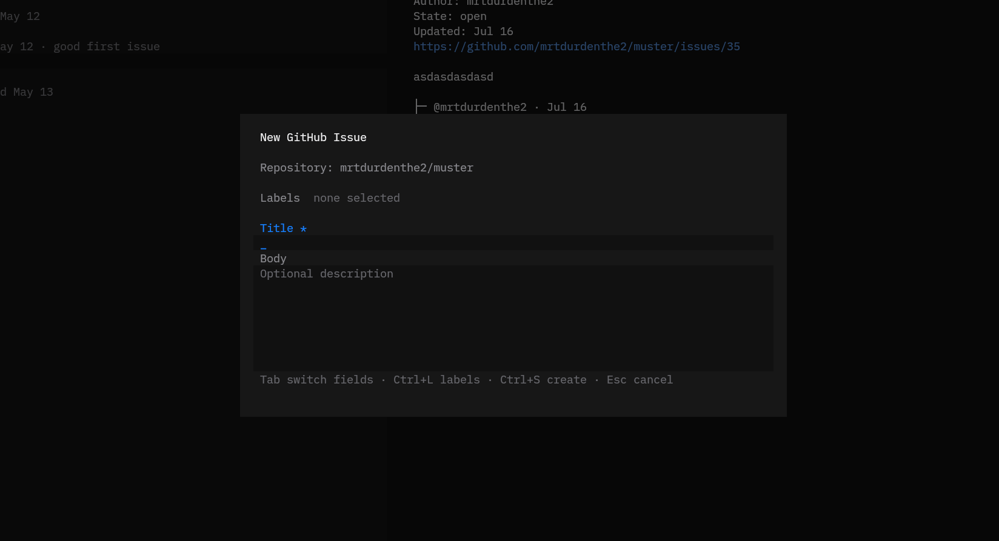

# muster

TUI for managing your issues across the land of GitHub.





## GitHub Access

muster uses the GitHub CLI for authentication so it does not manage or store GitHub tokens directly.

Requirements:

- Install `gh` from https://cli.github.com/.
- Authenticate with `gh auth login --hostname github.com --web --scopes repo,read:org`.

This project is still early, so expect bugs and inconsistencies.

Install the prebuilt `muster` command from npm:

```sh
npm install --global @kaiwlsn/muster
muster
```

Prebuilt binaries support macOS and glibc-based Linux on arm64 and x64. Bun is embedded in the binary and is not required at runtime. The npm launcher requires Node.js 20 or newer.

For development from this checkout, install [Bun](https://bun.sh/) and run `bun run start`. You can also use `npm link`; the development launcher falls back to the Bun source entrypoint.

## License and Source

muster is licensed under GPL-3.0-only. Corresponding source for each published binary is available from the matching version tag in this repository.

## Acknowledgments

The GitHub CLI authentication approach is based on Kit Langton's [`ghui`](https://github.com/kitlangton/ghui) GitHub authentication module.

## Local Reference Repositories

This project vendors external source repositories under `repos/` using squashed git subtrees so coding agents can inspect real implementation and usage patterns locally.

- `repos/effect`: Effect source and tests.
- `repos/opentui`: OpenTUI source, docs, and examples.

These directories are reference material. Application code should depend on published packages, not import from `repos/`.

## Updating References

```sh
git subtree pull --prefix=repos/effect https://github.com/Effect-TS/effect.git main --squash
git subtree pull --prefix=repos/opentui https://github.com/anomalyco/opentui.git main --squash
```
